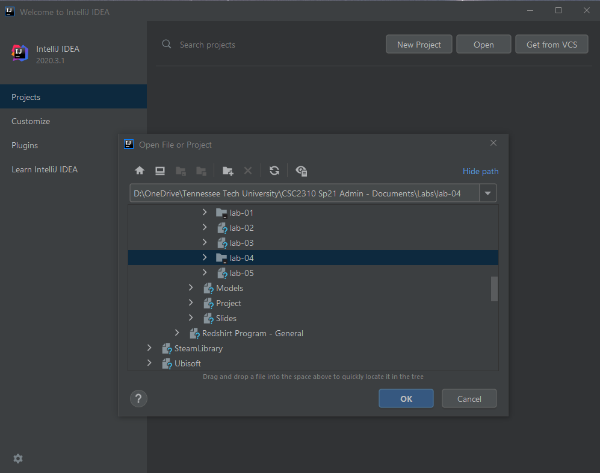
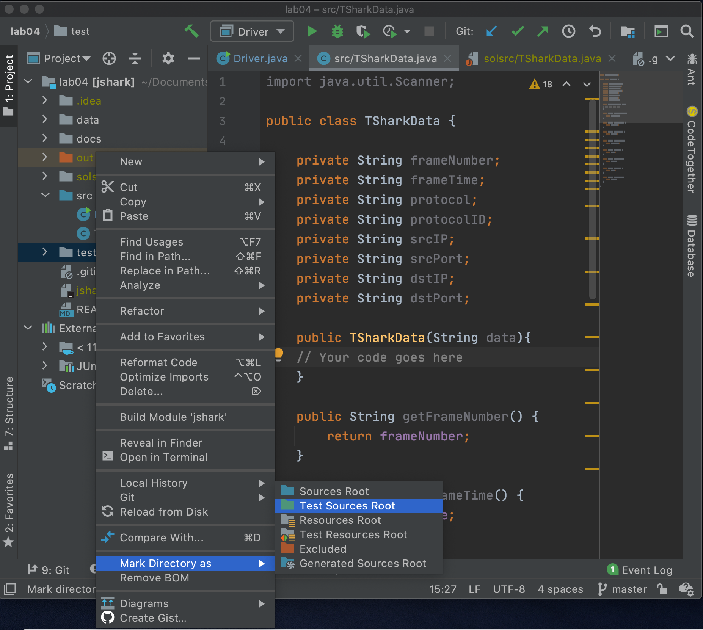
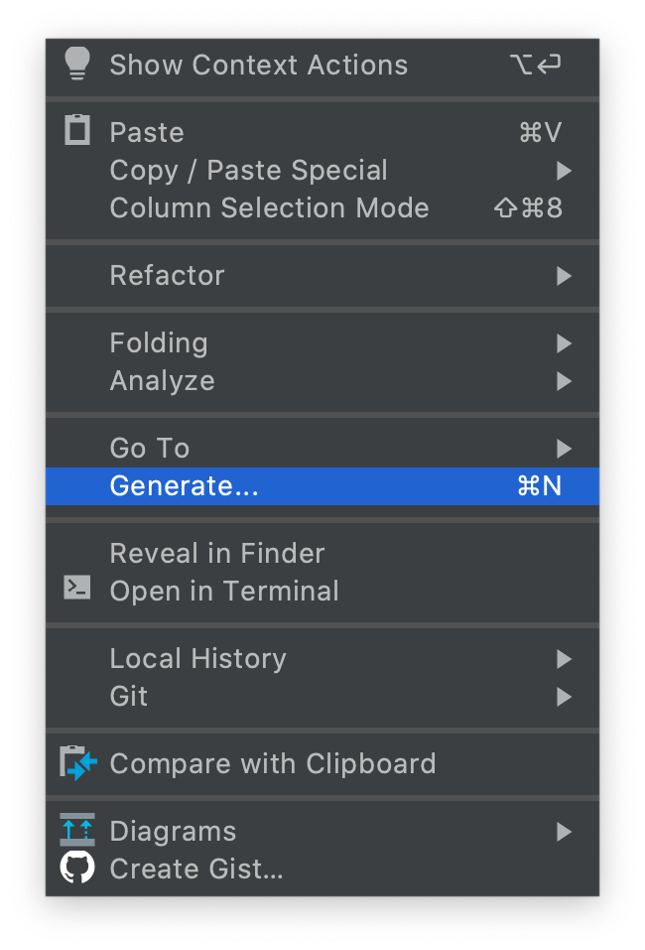
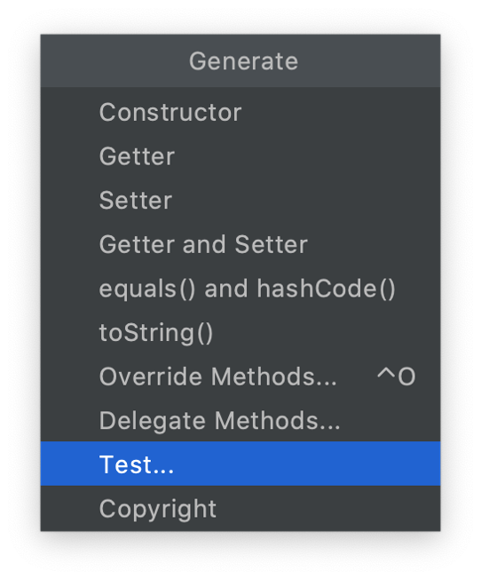
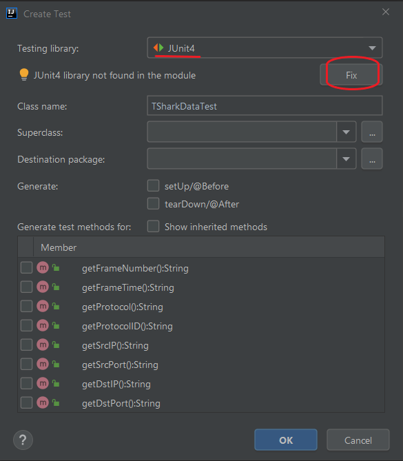

## Scanner Class and JUnit
### CSC 2310 

In this lab you will be practicing the following
* Use of JUnit to test a class
* Use of the Scanner class to read data from a file
* Setting values of attributes of a class
* Use of operations from the String class

### Pre-work
This lab assumes that you have Java 11 installed along with the IntelliJ IDE. It is also useful if you have the CodeTogether plug-in installed. 

Begin by changing your directory to a suitable working directory. Next, download the source code for the lab at your assigned url using the `git clone` command:
```text
https://gitlab.csc.tntech.edu/csc2310-fa21-students/yourid/yourid-lab-04.git
```
or by directly importing the project in IntelliJ using the `Get from Version Control` option, entering the url listed above when prompted.

### Sample Data
The codex for this data is the following:
```text
frame.number - index of the line of data read from network
frame.time_relative - time relative to beginning the capture of data from network
_ws.col.Protocol - character name of the protocol used
ip.proto - numeric code of the protocol used
ip.src - source of the data transmission
ip.dst - destination of the data transmission
tcp.srcport - port used by the source; of of either tcp or udp is used (but not both)
tcp.dstport - port used by the destination; of of either tcp or udp is used (but not both)
udp.srcport - port used by the source; of of either tcp or udp is used (but not both)
udp.dstport - port used by the destination; of of either tcp or udp is used (but not both)
```

The following is a list of sample data that you might expect to be used. Check the ``data`` directory for the ``jshark.csv`` file for more examples. **Notice that some of the data varies with some fields missing values and that each data field is encapsulated with quotes (").**
```text
"5","1.436394000","UDP","17","192.168.68.105","192.168.68.255",,,"889","889"
"6","1.536100000","ARP",,,,,,,
"7","1.774322000","TLSv1.2","6","192.168.68.126","52.114.159.112","55358","443",,
"8","1.774700000","TCP","6","192.168.68.126","52.114.159.112","55358","443",,
"9","1.779635000","DNS","17","192.168.68.126","71.10.216.1",,,"60389","53"
"10","1.780159000","TCP","6","192.168.68.126","52.114.159.32","55361","443",,
"11","1.780906000","TLSv1.2","6","192.168.68.126","34.192.73.106","55352","443",,
"12","1.781040000","TLSv1.2","6","192.168.68.126","34.192.73.106","55352","443",,
"13","1.813194000","DNS","17","71.10.216.1","192.168.68.126",,,"53","60389"
"14","1.825079000","TCP","6","34.192.73.106","192.168.68.126","443","55352",,
```

<!--### Generating Data
Data can be generated using tshark (you must download and install [Wireshark](https://www.wireshark.org/index.html#download) including
tshark.
```text
$ tshark -q -T fields -e frame.number -e frame.time_relative -e _ws.col.Protocol -e ip.proto -e ip.src -e ip.dst -e tcp.srcport -e tcp.dstport -e udp.srcport -e udp.dstport -E header=y -E separator=, -E quote=d -E occurrence=f > data.csv
```-->

### Importing the source code into IntelliJ
Begin by starting up IntelliJ. To get to the main dialog, select ``File > Close Project`` and then select ``Open``. At this point, the following window should be displayed. Select the directory that contains the source code for the lab and click ``OK``.


### Running JUnit
You will begin this lab by writing and executing your tests. To run the tests you must first configure IntelliJ to recognize your test code and to properly include JUnit4 as your test harness. The directions below describe how to do this.

##### Set up JUnit in your project
First, you must set the ``test`` directory as a ``Test Sources Root``. Right click on the ``test`` directory and select the ``Mark Directory as`` submenu, and set ``test`` accordingly.



Next, select the ``TSharkData.java`` file tab and then right click anywhere in the window as select ``Generate...`` and ``Test...``, which will then bring up a dialog called ``Create Test``.





In this dialog window, notice that the ``Testing Library`` will probably be set to ``JUnit5``. Select ``JUnit4`` as the testing library. If the message below that line reads ``JUnit4 library not found in the module``, click on the ``Fix`` button. Note that you do not need to select any of the methods in the dialog since the testing class has already been generated for you and is provided in the repository.



### Write your tests
The following classes have been created and provided in the repository you have downloaded. 

* TSharkDataTest
    * You will create test cases for the TSharkData class by modifying the TSharkDataTest class. Test methods have been created already. **You must update the methods to include cases for lines 5, 6, and 9 in the input data**. 
    * When writing your tests, you should use the ``assertEquals`` method to specify the following:
        * Name of your test
        * Expected Value
        * Actual Value
    * For example, you should add a testcase after the code shown below that uses the same two lines of code (i.e., a line to instantiate the data object, and a line to test the results).
    * (Hint: Don't overthink this step, it's simply adding two lines of code for each case with the second line literally being identical to the ``assertEquals`` line of code listed in the example.)
```java
@Test
public void getProtocol() {
    data = new TSharkData(
        "\"8\",\"1.774700000\",\"TCP\",\"6\",\"192.168.68.126\",\"52.114.159.112\",\"55358\",\"443\",,"
    );
    assertEquals("Protocol - Line 8", "TCP", data.getProtocol());
}
```
### Run Your Tests

**Before** you have writen any code, run your tests in IntelliJ by clicking on the ``run`` button in the interface as shown below.

<!---->


If you choose to run the full test suite you should see results similar to the output shown below.
<!----->


### Write Your Code

You have been provided a class called ``TSharkData``. You will be implementing the constructor for this class, using the ``Scanner`` class to read data and set individual attributes. The following model shows the details of the class.
    <!---->


You can simply create a Scanner object using the ``data`` parameter that is passed to the ``TSharkData`` constructor and then consume the input from the line of data. Your goal is to make each test pass by writing your code accordingly.

<!--* Driver
    * This class is reserved for future use, but has been provided for reference.-->


#### Turn-in

Using the ``terminal`` tab (shown in the image below), use the following commands to add submit your assignment via ``git``. The lab is due at the end of your assigned laboratory period.

```text
% git add .
% git commit -m "Completed assignment"
% git push origin master
```

This laboratory is worth 20 points.