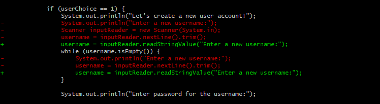

## Basic Git Usage
### CSC 2310 Lab-05

In this lab you will be practising the following
* Refactor dirty code in the given codebase
* Create a new branch in your git repository
* Merge one branch into another
* Push a local branch to the remote git repository

### Pre-Requisites
* Java 11
* Git
* IntelliJ IDE

Download the code base for the lab at your assigned url:
```text
%  git clone https://gitlab.csc.tntech.edu/csc2310-fa21-students/yourid/yourid-lab-05.git
```

### Laboratory Description

Included Java classes:
* **UserAccountDriver** - the main driver class of the program
* **User** - a model class for user account
* **InputReader** - a class containing methods to read integer and string values from the user

The provided program is a mock of console-based user account registration and login. It uses ``Scanner`` class to read input from the user. A new instance of this class is created each time the program wants to get user input, which is not a good practice.

**How to run the program?**

Navigate to the project folder in the terminal and run the following commands.
```text
% javac -d . src/com/csc2310/lab05/*.java
% java com.csc2310.lab05.UserAccountDriver
```

### Activity

Your goal is to refactor the code blocks that read the user input in a new git branch.

**Part 1:**

By default, you are in the `master` branch.
Create a new branch from the master branch named `code-refactor` using 
the `git checkout -b` command.
It will create the new branch while simultaneously checking that branch out.
```text
% git checkout -b code-refactor
```
Note: Usually we name a branch based on the task we are going to perform in that branch.

**Part 2:**

Next, we will modify the code in `UserAccountDriver.java` file to use the methods provided by the `InputReader` class in the `InputReader.java` file. Specifically, we will use the static method `getInputReader` of the `InputReader` class to get an instance of the `InputReader` class and then call `readIntegerValue` and `readStringValue` methods on the `inputReader` object to read the integer and string values respectively, as shown in the example below. Replace all the code blocks (5 altogether) being used to read values from the user with these methods.
Specifically, find all of the code similar to the following:
```text
System.out.println("Enter a new username:");
Scanner inputReader = new Scanner(System.in);
username = inputReader.nextLine().trim();
while (username.isEmpty()) {
    System.out.println("Enter a new username:");
    username = inputReader.nextLine().trim();
}
```
and replace it with code similar to this:
```text
username = inputReader.readStringValue("Enter a new username:");
while (username.isEmpty()) {
    username = inputReader.readStringValue("Enter a new username:");
}
```
In all, there should be 5 variations of this code.

**Part 3:**

Navigate to your git repository using command terminal. Or you can also launch **Git Bash** by right-clicking anywhere inside the repository folder.

The `git status` command below shows all of the changes made thus far while also showing you how to back out of your modifications.
```text
% git status
```

The `git diff` command shows the specific changes that you have introduced to various files.
```text
% git diff
```
Since you've modified the `UserAccountDriver.java` file, it will display the code changes in that file compared to the last commit. For the above example, you will an output similar to the screenshot given below. The `-` sign at the beginning of the line indicates that the line has been removed and the `+` sign indicates that the line has been added.



The `git add` command adds file contents to the git index which is the staging area between the working directory and the repository. It updates the index using the current content found in the working tree in order to prepare the content for staging of the next commit.
```text
% git add .
% git status
% git diff
% git diff --cached
```
Notice the difference when executing `git diff` and `git diff --cached`.

The `git commit` command records changes to the repository. It creates a new commit containing the current contents of the index and the given log message.
```text
% git commit -m "Completed assignment"
```

The `git log` command shows the commit logs.
```text
% git log
% git log --oneline
```
Notice the difference when executing `git log` and `git log --oneline`.

The changes you've made to the `UserAccountDriver.java` file are contained in the `code-refactor` branch, but not in the `master` branch. Use the `git checkout` command as shown below to switch to the `master` branch.
```text
% git checkout master
```
Open `UserAccountDriver.java` and observe its contents. You will see that the changes you made do not exist there. Also, check the git logs to see that the commit you made earlier does not exist. Switch back to the `code-refactor` branch to see your changes.
```text
% git checkout code-refactor
```
Now, check the contents of `UserAccountDriver.java` as well as the git logs. Notice the difference.


**Part 4:**

The `git push` command uploads local repository content to the remote repository.
The command below pushes the newly created local branch `code-refactor` to your remote repository along with the committed changes in that branch.
```text
% git push -u origin code-refactor
```
Note: The `-u` option sets the upstream i.e., the main repo that other people can pull from, e.g., your GitLab repo, so that in the future, you can just use `git push` without arguments.

Next, let's integrate the changes of the `code-refactor` branch in the `master` branch. For this, you need to merge the `code-refactor` branch with the `master` branch so that the changes are moved to the `master` branch.

Your current active branch is `code-refactor`. You need to first switch to the `master` branch.
```text
% git checkout master
```
Now your active branch is `master`. The `git merge` command below incorporates changes from the `code-refactor` branch into the current branch.
```text
% git merge code-refactor
```
Observe the `UserAccountDriver.java` file and the git logs. Then push the changes in the `master` branch to your remote repository.
```text
% git push origin master
```

#### Official Git Documentation:

- https://git-scm.com/docs
