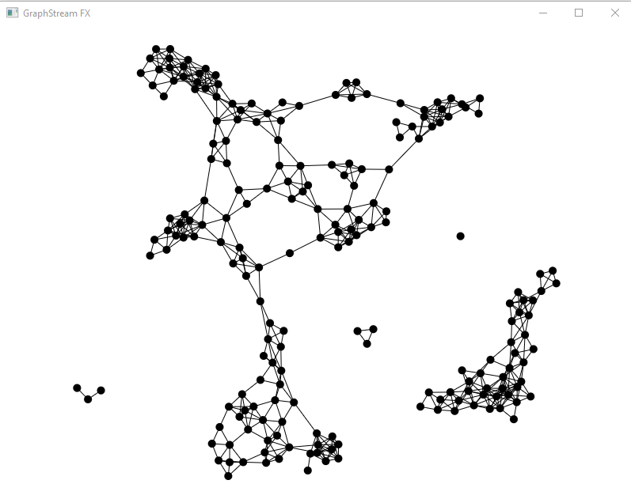

## Laboratory Exam and Project Setup
### CSC 2310 Spring 2021
This exam is due on March 22 at 8am. All files must be pushed to gitlab by this deadline. The primary activity
in this assessment is for you to:
* Use git to download the project files and dependencies
* Configure your development environment
* Build and execute the software
* Push the results back to gitlab 

### Files
Clone the project files from the following repository:

```text
https://gitlab.csc.tntech.edu/csc2310-sp21-students/youruserid/youruserid-vizshark.git
```

The files that are downloaded will appear in the following directories:

```data``` directory contains an image for the project

```src``` sources for the project

```lib``` directory is initially empty

### Modify
You must modify the ``Identity.java`` file, replacing ``no_user`` on line 3 with your userid.

### Dependencies
Download the libraries for [GraphStream](https://graphstream-project.org/download/) and [javafx SDK](https://gluonhq.com/products/javafx/) to a 
directory on your computer and then add them to the ``lib`` directory of your working project directory. Define an environment variable that has the
path to that ``lib`` directory.

* Link to [GraphStream](https://graphstream-project.org/download/) for download
    * gs-core-2.0.jar
    * gs-algo-2.0.jar
    * gs-ui-javafx-2.0.jar
* Link to [javafx SDK](https://gluonhq.com/products/javafx/) for download
    * javafx-sdk-11.0.2/lib/javafx-swt.jar
    * javafx-sdk-11.0.2/lib/javafx.base.jar
    * javafx-sdk-11.0.2/lib/javafx.controls.jar
    * javafx-sdk-11.0.2/lib/javafx.fxml.jar
    * javafx-sdk-11.0.2/lib/javafx.graphics.jar
    * javafx-sdk-11.0.2/lib/javafx.media.jar
    * javafx-sdk-11.0.2/lib/javafx.swing.jar
    * javafx-sdk-11.0.2/lib/javafx.web.jar

In the following, it is assumed that you have set the directory where you have saved the libraries to the $LIB (Linux/Mac) or %LIB% (Windows) directory and 
set your environment variable for that directory appropriately. 

*Windows users*: Note that when you download the ``javafx`` SDK, you will need to unzip the whole SDK and not just the jar files. You should see a bin, legal, and lib directory once unzipped.

Add the libraries to you CLASSPATH either in Windows, MacOS, or Linux. 
#### Linux or Mac
```bash
export CLASSPATH=$LIB/gs-core-2.0.jar:$LIB/gs-algo-2.0.jar:$LIB/gs-ui-javafx-2.0.jar:$LIB/javafx-sdk-11.0.2/lib/javafx-swt.jar:$LIB/javafx-sdk-11.0.2/lib/javafx.base.jar:$LIB/javafx-sdk-11.0.2/lib/javafx.controls.jar:$LIB/javafx-sdk-11.0.2/lib/javafx.fxml.jar:$LIB/javafx-sdk-11.0.2/lib/javafx.graphics.jar:$LIB/javafx-sdk-11.0.2/lib/javafx.media.jar:$LIB/javafx-sdk-11.0.2/lib/javafx.swing.jar:$LIB/javafx-sdk-11.0.2/lib/javafx.web.jar
```

#### Windows
```bash
set CLASSPATH=%LIB%\gs-core-2.0.jar;%LIB%\gs-algo-2.0.jar;%LIB%\gs-ui-javafx-2.0.jar;%LIB%\javafx-sdk-11.0.2\lib\javafx-swt.jar;%LIB%\javafx-sdk-11.0.2\lib\javafx.base.jar;%LIB%\javafx-sdk-11.0.2\lib\javafx.controls.jar;%LIB%\javafx-sdk-11.0.2\lib\javafx.fxml.jar;%LIB%\javafx-sdk-11.0.2\lib\javafx.graphics.jar;%LIB%\javafx-sdk-11.0.2\lib\javafx.media.jar;%LIB%\javafx-sdk-11.0.2\lib\javafx.swing.jar;%LIB%\javafx-sdk-11.0.2\lib\javafx.web.jar
```
Again, you must use ``export`` or ``set`` to define an environment variable for ``LIB`` in order to set your ``CLASSPATH`` correctly.

### IntelliJ Configuration
Using ``File -> Project Structure -> Libraries``, add the jar files downloaded above to configure your project. Also, ensure that the Java Project SDK is set to Java 11.

### Test Directory
Add a test directory and mark it in IntelliJ as a ``Test Sources Root``.

### Build
You must build your project using two methods:
1. Command-line build using ``javac`` with target directory of ``out``.
2. Build in IntelliJ by adding a run/build configuration **(Hint: see the "IntelliJ Introduction" video posted in the Videos area of iLearn)**
   The executable classes are ``VizSharkClient`` and ``GeneratorServer``. 
   
You must build (i.e., compile) the program with Java JDK Version 11.

### Run
The system must be run in two stages. If you are executing this from the command-line you will need to open two different terminal
or cmd windows. 

#### Command-line
1. Start the VizSharkClient application first
2. Start the GeneratorServer application after starting the client

When you run the system correctly, you will see a screen that looks like the following:


### Stage, Commit, and Push
After you have everything running, stage, commit, and push your repo back to the gitlab server. This includes all 
sources and output directories. 

### Rubric
You will be graded based on the following criteria:
* Build of the executable on the command-line
* Build of the executable in IntelliJ
* Push of committed files back to gitlab, including the contents of the ``out`` directory

The final note (i.e., pushing the ``out`` directory) is a critical part of the evaluation. Failure to include
the contents of the ``out`` directory *after* you have built the system will severely impact your grade. 