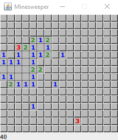
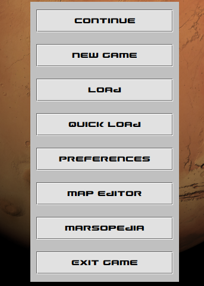

## Lab 1
### CSC 2310 Spring 2021
In this laboratory you will practice compiling and running java programs. The goals are the following:
* Download laboratory files from the course gitlab repository
* Compile a simple program
* Run a compiled program <!-- * Observe typical compilation errors-->
* Setting a CLASSPATH 
* Run a program using an executable jar
* Run a program using the ```-cp``` option

#### Pre-Work
In this laboratory, we assume that your environment was set up according 
to the Lab 00 specification. In particular, you must have the following working:
* ``java`` and ``javac``
* ``git``

You will make extensive use of a terminal command-line interface appropriate to
the operating system of your system (i.e., ```cmd.exe``` for Windows or
```bash``` in MacOS or Linux).

#### Lab setup

To begin the lab, download all of the source files for this lab by changing into a working directory and typing the following command:

```text
% git clone https://gitlab.csc.tntech.edu/csc2310-sp21-students/%youruserid%/%youruserid%-lab-01.git
```

replacing, ```%youruserid%``` with your Tennessee Tech userid.

The files included in the distribution include two directories:
* ```freemars``` - a Civilization clone based in Mars
* ```minesweeper``` - a Java implementation of the classic minesweeper game

Next, use the following the command (as appropriate for your OS):

Linux/Mac OS
```txt
% export CLASSPATH=/
```

Windows
```txt
% set CLASSPATH=C:\
```

#### Compiling Programs
Programs are compiled using the ```javac``` command with the following
basic structure:

```bash
% javac -d %out% -cp %classpath% %sourcefiles%
```

where:
* *%out%* is an output directory
* *%classpath%* is a classpath containing libraries or binaries
* *%sourcefiles%* is a list of .java source files

Included in the ```minesweeper/src/com/zetcode``` directory are the source files for the *minesweeper* game.
Change to the ```minesweeper``` directory and using the command format provided above, compile each of the *.java* files
found in the ```minesweeper/src/com/zetcode``` directory as follows:

* Omit the ```-cp %classpath%``` option
* Specify ```-d .``` for writing of the compiled output files
* You may specify the source files using a wildcard (i.e., "```*.java```")

After compiling the program, the following files should be located in the
```com/zetcode``` directory:

* ```Board$MinesAdapter.class```
* ```Board.class```
* ```Minesweeper.class```

#### Running a program with a simple classpath and the ```-cp``` option
Java programs can be executed by using the ```java``` command with the following
pattern:

```bash
% java -cp %CLASSPATH% %MAIN_CLASS%
```
where
* %CLASSPATH% is the colon (Windows) or semi-colon (Mac/Linux) separated list
of jarfiles (using full path to the file) or class files (using full path to the 
directory containing class files)
* %MAIN_CLASS% is the name of the class containing the ```main``` method for the program

When running a ```java``` program, the virtual machine needs to know where to find 
the location of the compiled classes. The ```CLASSPATH``` variable specifies this location.

While in the ```minesweeper``` directory, run the program by typing the following:

```shell
% java Minesweeper
```

You should note that we have not specified the ```-cp``` parameter.
You should see the following error:

```bash
Error: Could not find or load main class Minesweeper
Caused by: java.lang.ClassNotFoundException: Minesweeper
```

What is the problem? The class is part of the com.zetcode package and the
full name must be specified:

```shell
% java com.zetcode.Minesweeper
```

When we compiled the program, where did the class files get generated (i.e., 
where is the root of the path for where the files were generated)? 

Another potential problem will occur if the classes are not found in the current classpath. Using
the information about the class files, run the program by setting the classpath using the ```-cp``` option and specifying the ```"."``` directory. 

Running the program should result in a program similar to the 
following:



#### Running with a set CLASSPATH
When running a java program that has a large number of dependencies, the setting of the
classpath variable is preferred over setting the ```-cp``` parameter. As mentioned in class,
the ```java``` VM searches the ```CLASSPATH``` variable for a list of libraries to include as
part of the executable for the program.

Begin by changing into the ```lab-01/freemars``` directory and issuing the following command depending on your OS.

Linux/MacOS
```txt
export CLASSPATH=$CLASSPATH:$PWD/FreeChart.jar:$PWD/FreeMars.jar:$PWD/FreeMarsEditor.jar:$PWD/FreeMarsHelp.jar:$PWD/FreeMarsImages.jar:$PWD/FreeMarsUI.jar:$PWD/FreeRealm.jar:$PWD/FreeRealmBasicCommands.jar:$PWD/FreeRealmBasicOrders.jar:$PWD/FreeRealmExecutor.jar:$PWD/FreeRealmXMLConverter.jar:$PWD/jh-2.0_05.jar:$PWD/log4j-1.2.17.jar:$PWD/xercesImpl.jar
```

Windows
```txt
set CLASSPATH=%CLASSPATH%;%cd%\FreeChart.jar;%cd%\FreeMars.jar;%cd%\FreeMarsEditor.jar;%cd%\FreeMarsHelp.jar;%cd%\FreeMarsImages.jar;%cd%\FreeMarsUI.jar;%cd%\FreeRealm.jar;%cd%\FreeRealmBasicCommands.jar;%cd%\FreeRealmBasicOrders.jar;%cd%\FreeRealmExecutor.jar;%cd%\FreeRealmXMLConverter.jar;%cd%\jh-2.0_05.jar;%cd%\log4j-1.2.17.jar;%cd%\xercesImpl.jar
```

Once you have set the classpath, you should attempt to run the program making note of the following:
* The classpath is already set so there is no need to include the ```-cp``` parameter
* The main class is ```org.freemars.FreeMarsLauncher``` 

If successful, a screen similar to the following should appear:



If you receive the following error, then the classpath has not been correctly
specified:

```bash
Error: Could not find or load main class org.freemars.FreeMarsLauncher
Caused by: java.lang.ClassNotFoundException: org.freemars.FreeMarsLauncher
```

#### Create an executable jar
Clearly, in practice programs are not usually executed from the command-line
interface. Java provides a program called ```jar``` that supports packaging
a ```java``` program for deployment.

In order to create an executable jar, you must do the following:
* Create a manifest file that specifies the main class of the program
* Compile the program using the ```javac``` compiler as usual
* Create an executable using the ```jar``` program

*Create the manifest*

The following code shows the contents of the MANIFEST.MF file included
in the ```minesweeper``` directory.

```manifest
Manifest-Version: 1.0
Main-Class: com.zetcode.Minesweeper
```

*Compile the program*

See the earlier part of the exercise where you compiled the ```minesweeper``` program.

*Create the executable jar*

The following command is used to generate an executable jar. Note the order
of the files specified: ```jar cvfm %jarfilename% %manifest% %classes% %resources```

```shell
% jar cvfm minesweeper.jar MANIFEST.MF ./com resources
```

You can test this process two ways: with the command-line interface and by
double clicking the generated file in the GUI interface of your OS.

*Command-line*
```shell
% java -jar minesweeper.jar
```

### Turn-in
This laboratory is worth 20 points and requires you do three things before the end of the lab:

1. Demonstrate that you have a compiled and running version of Minesweeper (5 points)
2. Demonstrate that you have a running copy of Freemars (5 points)
3. Demonstrate that you have an executable (clickable) jar for Minesweeper (5 points)

You will also receive 5 points for attendance.