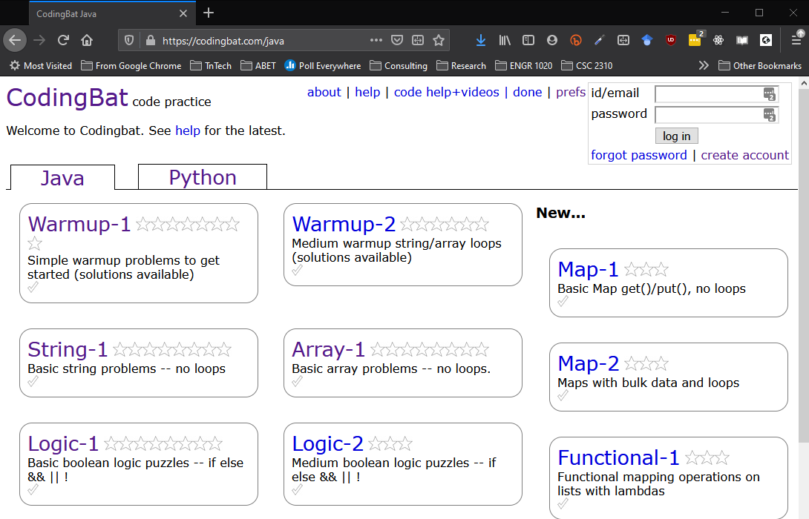
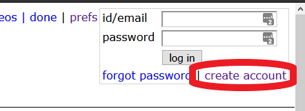
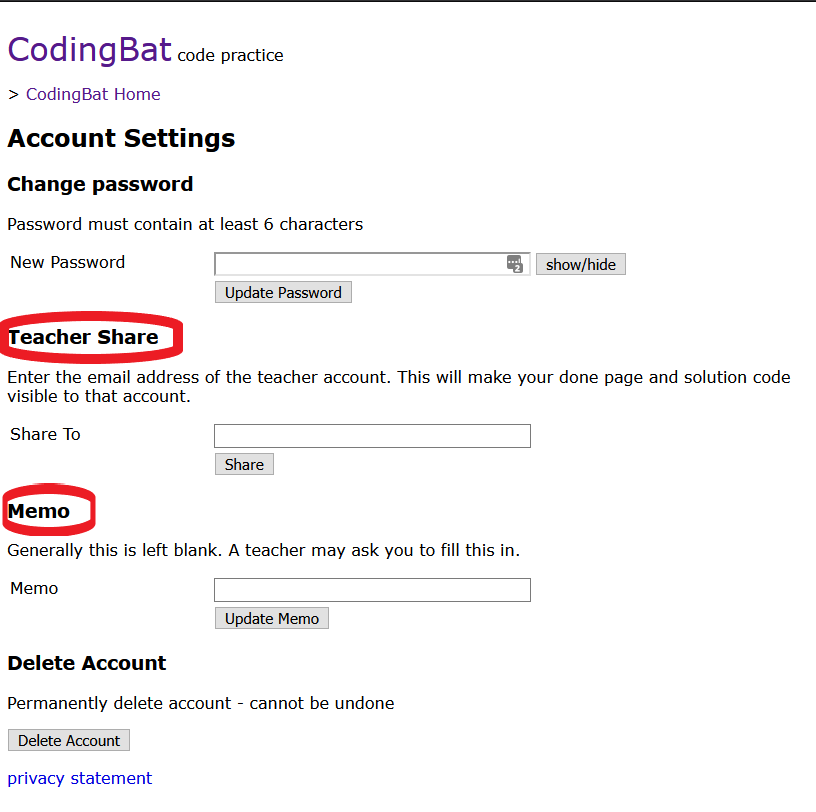

## Introduction to Java using Codingbat
### CSC 2310 Spring 2021

In this lab you will begin learning the Java programming language by writing code using the [codingbat](https://codingbat.com/java) website.

#### Pre-work
This laboratory makes use of the [https://codingbat.com/java](https://codingbat.com/java) website, which contains several exercises for practicing programming using Java. The site uses a _Test-Driven Development_ (TDD) approach for programming whereby tests are written first and the goal of the programmer is to make their code pass the test.

Before starting the lab, go to the above link and create an account using your TNTech account by selecting 
* Create an account using your TNTech account

* Next, add your lead TA's e-mail address to the **Teacher Share** field, and your Section number to the **Memo** field using the **prefs** menu.

SECTION	| DATE / TIME | LEAD TA
--------|-------------|--------
Section 102 | T 1200pm – 0120pm	| Karagoz, Emre <<ekaragoz42@tntech.edu>>
Section 103	| R 1200pm – 0120pm	| Karagoz, Emre <ekaragoz42@tntech.edu>>
Section 104	| T 0300pm – 0420pm	| Shakya, Raunak <<rshakya@tntech.edu>>
Section 105	| R 0300pm – 0420pm	| Shakya, Raunak <<rshakya@tntech.edu>>

### Laboratory Description

After creating and configuring your account, you must complete the following exercises:

* AtFirst: https://codingbat.com/prob/p139076
* Double23: https://codingbat.com/prob/p145365
* FizzString2: https://codingbat.com/prob/p115243

Long-term, after the completion of the laboratory, it is suggested that you continue to try completing some of the codingbat exercises as practice. Here are some suggested exercises:

* MakeTags: https://codingbat.com/prob/p147483
* Reverse3: https://codingbat.com/prob/p112409
* AnswerCell: https://codingbat.com/prob/p110973

#### Turn-in

Your turn-in for this laboratory is to complete the exercises indicated above, remembering to add your lab instructor to the **Teacher Share** field in the *prefs* menu. **The TA's will create a snapshot of the lab completion report no later than 10 minutes after the assigned laboratory section ends.**

This laboratory is worth 20 points.