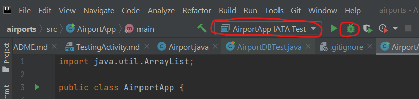
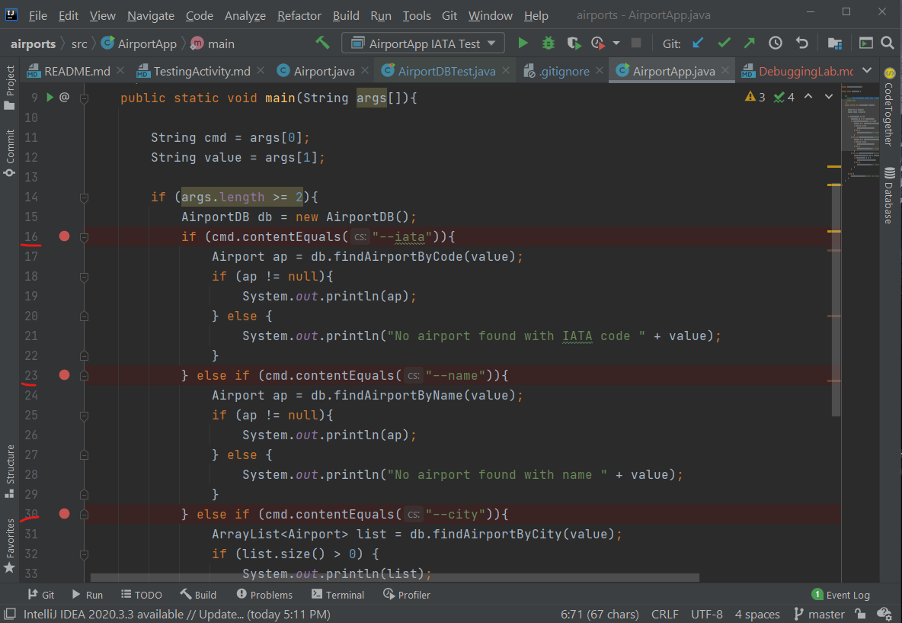
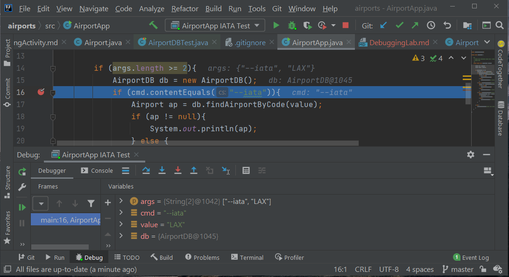
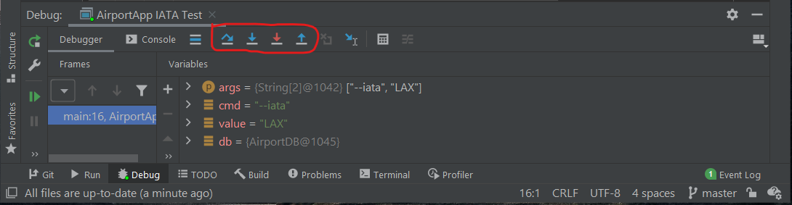
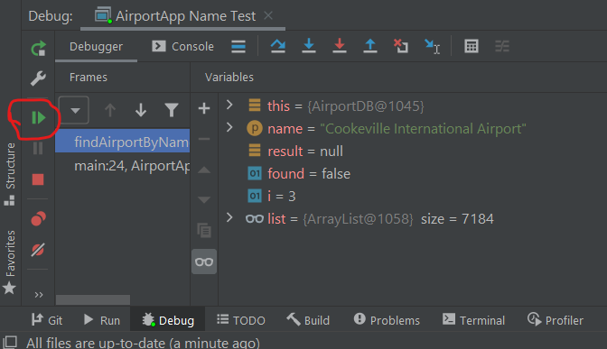

## Debugging in IntelliJ
### CSC 2310 Spring 2021

In this lab you will be practicing how to use IntelliJ to do basic debugging, including:
* Setting Breakpoints
* Starting and Pausing a Session
* Step Over
* Step Into
* Viewing and changing variable values
* Full resume

### Pre-work
This lab assumes that you have Java 11 installed along with the IntelliJ IDE. 

Begin by creating and changing into a suitable working directory. Next, download the source
code for the lab at your assigned url:
```text
$ git clone https://gitlab.csc.tntech.edu/jgannod1/csc2310-sp21/lectures/airports.git
```

### AirportApp
The program you will be "debugging" is sample application whose development was presented 
[here](https://media.tntech.edu/playlist/dedicated/1_iutg1fl9/).
The lab files include run configurations named as follows:
* ``AirportApp IATA Test``: runs the program using options ``--iata "LAX"``
* ``AirportApp City Test``: runs the program using options ``--city "nashville"``
* ``AirportApp Name Test``: runs the program using options ``--name "Cookeville International Airport"`` 

You can find the list of run configurations in the dropdown menu shown in this image. To
start the debugger, select a run configuration and press the "bug" icon.



A debugger works, in part, by selecting breakpoints and then running the program in "debugging" mode.
The program will be executed until it reaches the first breakpoint and will pause at that statement.
At that point you can choose to do any number of things, including:
* Execute the program step-by-step
* Explore the current state of the program
* Resume the program, stopping it when it hits the next breakpoint

#### Selecting Breakpoints
To set a breakpoint in IntelliJ, click in the grey area to the right of the line numbers in a Java
program. The lines where breakpoints are set will be highlighted accordingly.

For instance, for this lab, add breakpoints at lines 16, 23, and 30 where the
code checks the contents of the ``cmd`` variable.
```text
16  if (cmd.contentEquals("--iata")){

23  } else if (cmd.contentEquals("--name")){

30  } else if (cmd.contentEquals("--city")){
```



#### IATA Test
Begin by running the debugger for the ``AirportApp IATA Test`` with the breakpoints set as indicated above.
When the debugger pauses, the windows should appear as follows:



You should notice the debug panel at the bottom of the screen, which
includes a control panel (circled) with the following buttons:
* Step Over - Run the line of code, "stepping over" any method calls, keeping the view in the current method
* Step Into - Execute a line of code, entering into any methods and shifting the view to the called method 
* Force Step Into - Same as previous, but "force" any method calls, whether they were to be called or not
* Step Out - If in an method, step to the first line executed after returning from the current method



#### Variables
The Variables panel provides a list of variables that are currently in scope for the
method currently being executed. The variables include values for any primitives and objects
that may be currently active.
You should make note that the ``cmd`` variable has the value ``--iata``, and the
``value`` variable has the value ``LAX``.

Using the Variables panel, expand the ``db > list`` variable, and scroll to index 9 for
"Thule Air Base".
**In the quiz for Lab 06, select the latitude and longitude for the Thule Air Base.**

#### Step Over and Step Into
At this point in the exercise, you should be paused at this line of code: ``if (cmd.contentEquals("--iata")){``.
If you are not, restart the debugging session.
* Using ``Step Over``, and ``Step Into``, enter the ``findByAirportCode`` method. Use the ``Step Over`` button
several times to iterate through the for loop several times. This command can be used often to explore
the execution of a program.
* Use the ``Step Out`` button. **In the quiz for Lab 06, select the line of code that is highlighted.
* Use the ``Run`` button (highlighted below) to resume the program. It should finish the program. If you click on the
``Console`` tab, you will see the message ``Process finished with exit code 0``.



#### Deep "Step Into"
Set a breakpoint on line 19 and run the debugger until it stops at that line. Step into the ``System.out.println(ap)``
method using the debugger. Report on your observations of what the debugger does as you step into and
through the code.
**Add your response to the quiz for Lab 06.**

#### Find the index
Using the debugger, use a combination of setting breakpoints, stepping over various statements, the run button, etc.,  
use the ``AirportApp City test`` run configuration to find the index ``i`` found for ``Nashville`` in the ``findAirportByCity`` method. **Add your response to the quiz for Lab 06.**

#### Change values
The debugger will allow you change the values of variables in order to modify the behavior of a program.
Using the ``AirportApp IATA Test``, start a debugging session with the breakpoints as indicated above.
When it pauses, right-click on the ``value`` variable and change ``"LAX"`` to ``"DTW"`` 
using the ``Set Value...`` menu item.
Step over the statements in the program and observe what happens when the call to ``db.findAirportByCode(value)``
is completed. 
**Enter your response to the quiz for Lab 06.**

