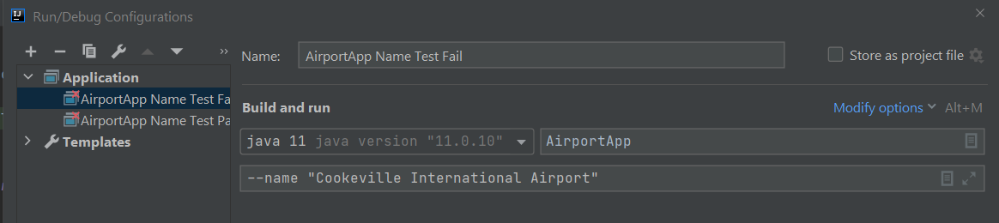
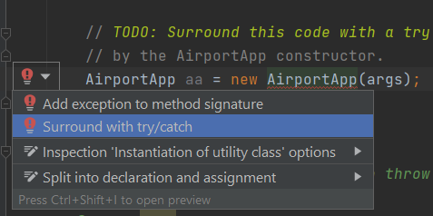

## Exception Handling
### CSC 2310 Spring 2021 Lab-07

In this lab you will be practicing the following:
* Modify code to throw exceptions
* Modify code to handle exceptions

### Pre-requisites
* Java 11
* Git
* IntelliJ IDE

Download the code base for the lab at your assigned url:
```text
%  git clone https://gitlab.csc.tntech.edu/csc2310-sp21-students/yourid/yourid-lab-07.git
```

## Laboratory Description

In this lab you will be modifying the ``AirportApp.java`` class to throw and
handle exceptions when the search for airports fail.

### Run the program
Create two run configurations in IntelliJ that run the program with the following parameters:

Pass version (AirportApp Name Test Pass)
```text
--name "Los Angeles International Airport"
```

Fail version (AirportApp Name Test Fail)
```text
--name "Cookeville International Airport"
```



You should run the application using the debugger to observe which lines of code are executed
in the AirportApp program when running each of the configurations. In particular, set a breakpoint
at line 32:
```text
if (cmd.contentEquals("--iata")){
```
and step over the code to observe each of the cases for when airports are either found or not found.

### Modify the code
We would like to change the code so that it throws an exception when the airport search operations fail.
This occurs when ``db.findAirportByCode(value)`` or ``db.findAirportByName(value)``
return ``null``, or in the case of ``db.findAirportByCity(value)``, return an empty list.
The code has been updated with ```// TODO:``` comments that indicate the changes that need to
be made to the code.
Specifically, you must do the following:
* Change the signature for ``public AirportApp(String args[])`` to specify that the method throws an exception
* Change the method so that it throws exceptions as indicated above.
* Handle the exception

#### Signature Change
To specify that a method throws an exception, you must add the ``throws`` modifier to the 
method signature along with the name of the exception class to be thrown. In this exercise,
you will throw ```AirportException``` objects.

#### Throw the exceptions
To throw an exception you must instantiate an exception object and then use the ``throw`` command.
When instantiating an ``AirportException`` object you should pass a message string. This is the
message that will be displayed by the ``getMessage()`` method.

```text
AirportException ex = new AirportException("Some message");
throw ex;
```

#### Handle the exception
When you modify the signature of the ``AirportApp`` constructor, the call to the constructor on line 13
will be marked as needing to be surrounded by a ``try-catch`` block.
In IntelliJ you will see a menu that allow you to generate the ``try-catch``:
.

When you do this, a ``catch`` block will be created with a line of code that looks like the following:
```text
e.printStackTrace();
```
Change this line using ``e.getMessage()`` so that the exception handler prints the following message
when running the fail scenario:
```text
Searching for Cookeville International Airport...
Exception (AirportDB Search: No airport found with name Cookeville International Airport)
```

### Submission
When you have completed the lab stage your changes, commit them, and push to gitlab. The lab is
worth 20 points.