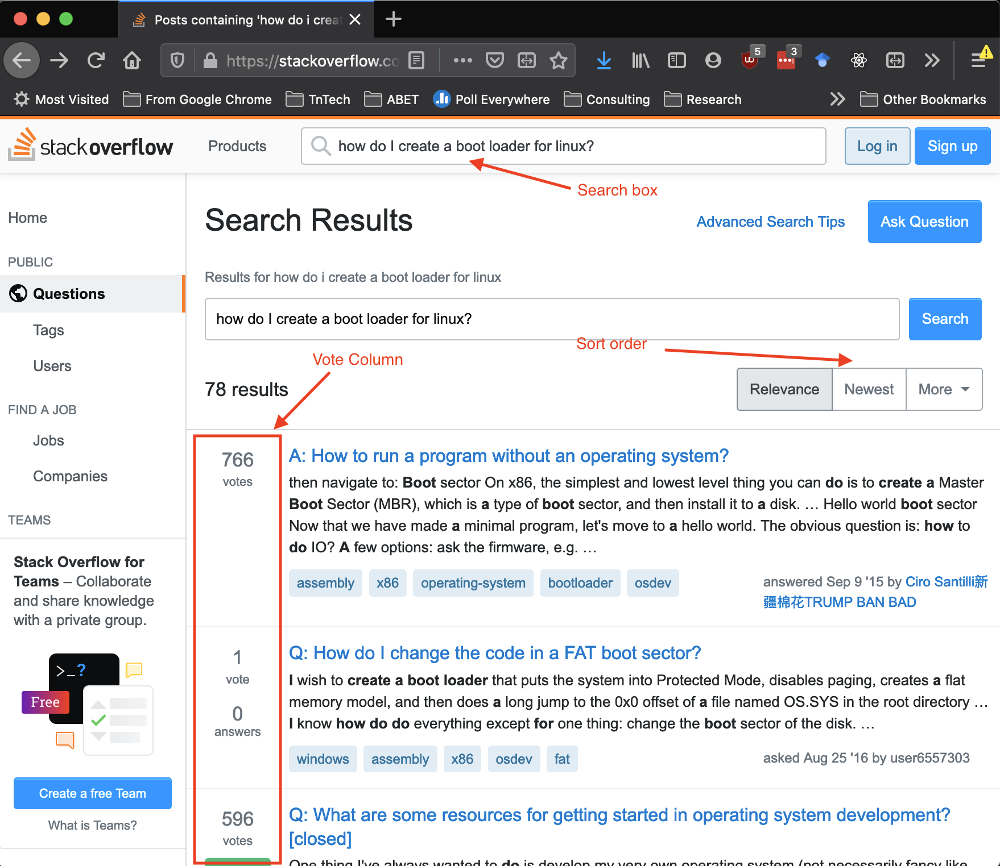
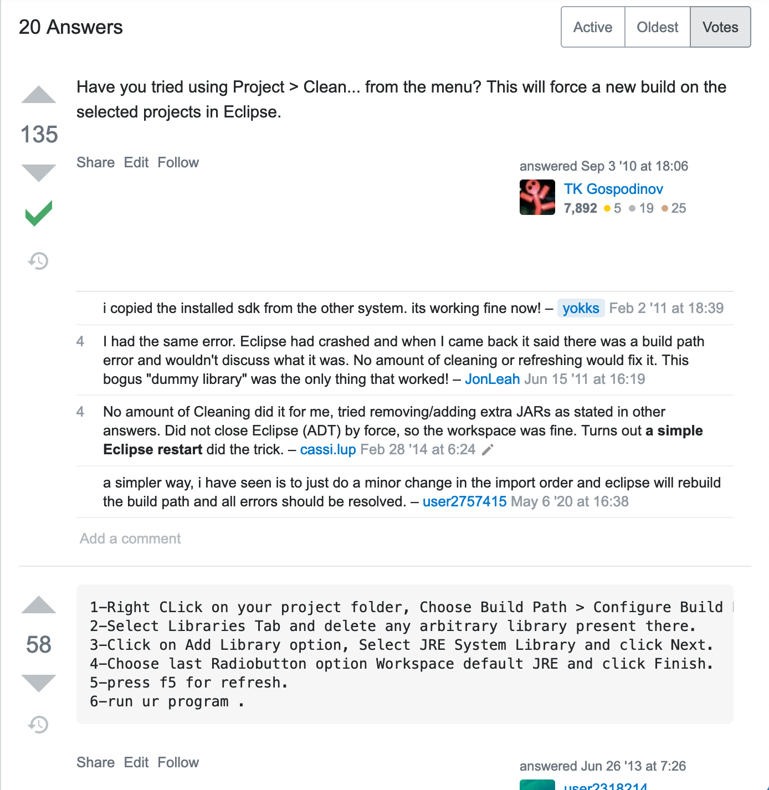

## Stackoverflow
### CSC 2310 Spring 2021 Lab-08

In this lab you will explore the use of [Stackoverflow.com](https://www.stackoverflow.com) as a source for seeking answers to common programming problems.

* What is stackoverflow?
* Questions on Stackoverflow
* Interpreting answers

### Pre-requisites

* Java 11
* Git
* IntelliJ IDE

Download the code base for the lab at your assigned url:
```text
%  git clone https://gitlab.csc.tntech.edu/csc2310-sp21-students/yourid/yourid-lab-08.git
```

### What is Stackoverflow?
Stackoverflow ([https://stackoverflow.com](https://stackoverflow.com)) is a reputation-based site for
posing and answering questions typically related to
the technical domain. As a reputation-based system, the site provides a means for interpreting the quality of the responses according to the use of votes and
the reputation of individual users.

When programming it is often the case that you will have at least one browser tab open to the Stackoverflow site. Indeed, it is not uncommon to have
one display monitor devoted specifically to finding
answers to common issues encountered in programming.

#### Create an account
It is suggested that you create an account on Stackoverflow to create a profile. You can do this [here](https://stackoverflow.com/users/signup?ssrc=head&returnurl=%2fusers%2fstory%2fcurrent) - ([https://stackoverflow.com/users/signup?ssrc=head&returnurl=%2fusers%2fstory%2fcurrent](https://stackoverflow.com/users/signup?ssrc=head&returnurl=%2fusers%2fstory%2fcurrent)).
Most probably, you have already done this in the class as well as taken the tour at https://stackoverflow.com/tour.

### Questions on Stackoverflow
Stackoverflow is primarily concerned with the following:

* Asking Questions: https://stackoverflow.com/help/how-to-ask
* Answering Questions: https://stackoverflow.com/help/how-to-answer
* Searching for answers: https://stackoverflow.com/help/searching

Each of the above links provides an overview of how to do each.
Note that there are limitations to what you can do on the site until you have built up a certain reputation score. However, you are able to ask, answer, and search with little or no issue regardless of your reputation.
When you use the search feature you will be presented with a page that looks similar to the following:

Notice two things in particular:
* Sort Order - you can change the filtered order so that you see questions and responses according to *relevance*, *newest*, and *votes* (not shown).
* Vote Column - shows the number of votes that a question received, which provides you a sense of the popularity of a question.

### Interpreting answers
When you find an answer that is relevant you still have the job of selecting an appropriate solution.

* While you may find direct answers to your problem, you may have to interpret the answers to determine what is different from your own particular situation. In particular, you'll have to use critical thinking to determine relevancy of both the question and answer. As such:
    * Should you rewrite the query?
    * Should you look at other potential questions that were retrieved in the search?
    * Is there some aspect of the answer that is the same as my situation that could apply? Remember that the names of classes or other objects will probably be different but the problem may be the same.
* Some answers may be inherently risky to try so you should try to understand the answer before incorporating it into your code.
    * You could use git's branching capability to create a branch for trying out some solution to avoid having to go back to your original solution.
    * You should pay particular attention to whether the solution creates a cybersecurity issue.
* Look at other solutions that have been suggested rather than just going to the first one in the list. For instance, take a look at the following answer. The first is the top voted, but the second answer may be more appropriate.
  

### Laboratory Description

The provided program reads a csv file containing the stock data of 10 companies for April 01, 2021 and sorts the companies based on the closing price of that day. 
It employs QuickSort algorithm and implements Comparable interface of Java to achieve sorting of the records.

**How to run the program?**

Open the project in Intellij IDE and run the driver class `StockQuickSortDriver`.

Shown below is the expected output:
```
CSCO / 51.98
KO / 52.51
AAPL / 123.0
WMT / 135.62
MCD / 225.21
MSFT / 242.35
BA / 252.96
FB / 298.66
GOOGL / 2129.78
AMZN / 3161.0
```

However, the program execution will throw an error because something's not correct with the file read.

### Activity

Your goal is to fix the program error by searching for the solution on Stackoverflow.

Go through the error message that is displayed when you run the program and locate the section of the code from where the error originates. You will notice a `NullPointerException` being thrown from the code block inside the `while` loop that reads each line of the file. The conditional expression for the while loop `!file.EOF()` indicates that the loop will run until it reaches EOF i.e., End Of File. Each time you call the `readLine()` method, the program reads the current line of the file and advances to the next line. If you call it when there is no next line to be read, it returns a null value.

Look for the solution to this issue on Stackoverflow and apply it so that when you run the program, you get the expected output as shown above.

**Hint:** You need to find the correct replacement for the conditional expression of the `while` loop.

### Submission
When you have completed the lab, stage your changes, commit them, and push to gitlab.
