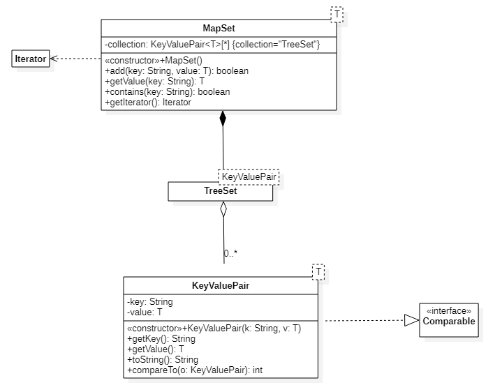

### MapSet
`MapSet` is a generic Class that is used to manage `KeyValuePair` objects.
The `MapSet` contains an embedded `TreeSet` collection that is used
as the main storage for the objects. The `KeyValuePair` class is also
a generic class that has a String as the key, and a generic class
as the value.
The `KeyValuePair` class implements the `Comparable` interface in order
to support search and indexing of the `KeyValuePair` objects within the
`MapSet`.



#### Download
```text
$ git clone https://gitlab.csc.tntech.edu/jgannod1/csc2310-sp21/lectures/generics.git
$ git checkout practice
```

#### Classes
* KeyValuePair
* MapSet
* Driver

#### Things to try
* Implement the `KeyValuePair` class by implementing the methods shown in the diagram.
* Implement the `MapSet` class by implementing the method shown. The `getValue` and `contains` methods should iterate through
  the collection `TreeSet`. The `getIterator` method returns an iterator from the
  `TreeSet` collection.

#### Download
```text
$ git clone https://gitlab.csc.tntech.edu/jgannod1/csc2310-sp21/lectures/generics.git
```
#### Solution
The solution can be viewed by checking out the solution branch
```text
$ git checkout solution
```