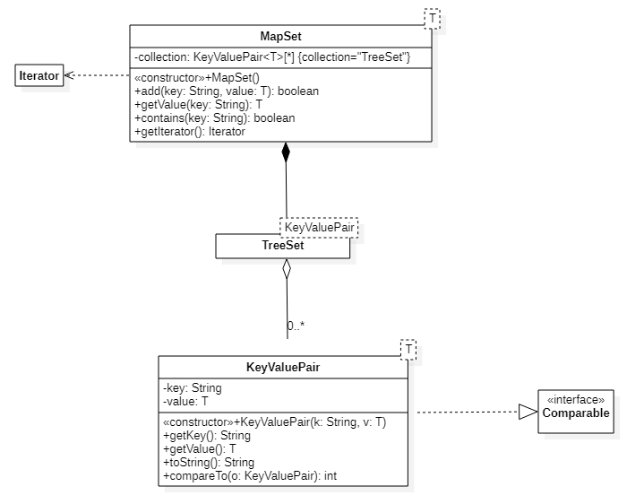

## Generic Classes
### CSC 2310 Spring 2021 Lab-09
In this lab, you will be completing the MapSet generic
class that we began in class.
Primarily, you will be implementing the following methods:

* add - add a key-value pair to the collection. Returns true or false if the 
depending on successful add to the map.
* getValue - return the value part of a key-value pair if the input
`key` is found in the collection
* contains - returns true or false depending on whether a key-value
pair indexed by the `key` 
* getIterator - returns the iterator of the embedded collection

The model for this project 


### Pre-requisites

* Java 11
* Git
* IntelliJ IDE

Download the code base for the lab at your assigned url:
```text
%  git clone https://gitlab.csc.tntech.edu/csc2310-sp21-students/yourid/yourid-lab-09.git
```

### Activity
To help with this activity, you may need to refer to the documentation
for the TreeSet<T> class: https://docs.oracle.com/en/java/javase/11/docs/api/java.base/java/util/TreeSet.html

A JUnit test class (MapSetTest) has been created to aid with your software
development activities.

### Submission
Stage, commit, and push your repo to gitlab, as usual.

### Rubric
The assignment is worth 20 points (5 points per method)